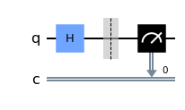
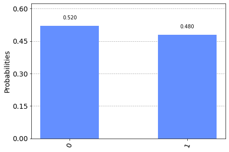

# A Technical Explanation of Quantum Superposition in Quantum Computing

You might’ve heard all sorts of analogies trying to explain what superposition is. Whether it’s a cat in a box that’s both alive and dead (i.e. Schrödinger's cat), a flipped coin that’s both heads and tails, or an electron in both spin up and spin down, quantum superposition is definitely a strange and fascinating topic.


&nbsp;   &nbsp;   &nbsp;   &nbsp;   &nbsp;  &nbsp;   &nbsp;   &nbsp;   &nbsp;   &nbsp; 


## Introduction

This article assumes that you have a basic understanding of what quantum superposition is (if not, check out some of the helpful resources found at the bottom of this article that will introduce you to this concept).

Quantum superposition is one of the three quantum phenomenons that enable quantum computers to compute in ways classical computers cannot. 

A technical explanation for quantum superposition is that a __quantum system__ (i.e. a qubit) can exist in a `quantum state` (i.e. |0> or |1>) that is a linear combination of multiple `quantum states`.

Let’s break down that definition just a little bit.

(Just as a disclaimer, this article is going to dive into some of the basic mathematical representations of quantum superposition. Although it is not an extensive overview, it does give a basic understanding of how linear algebra is used in quantum computing. Understanding such mathematical concepts is very important for one to grow in their knowledge of quantum computing, since many quantum algorithms, such as Shor’s Algorithm, which shows that quantum computers have the ability to crack RSA encryption, are best understood if one understands the underlying mathematical concepts).

## Quantum System

So what exactly is a __quantum system__? Well in quantum computing, our __quantum system__ is a qubit, the quantum version of a classical bit which can be found in your regular classical computer.

(We won’t worry too much about the physical implementation of a qubit in this article, because there are a variety of different ways to build a qubit.)

<<<<<<< HEAD
Since superposition allows for a qubit to be in two states simultaneously (|0> and |1> at the same time), n qubits will represent 2<sup>n</sup> `quantum states`. This allows for an exponential increase in complexity: 1 qubit can simultaneously represent 2 `quantum states`, 2 qubits 4 `quantum states`, 3 qubits 8 `quantum states`, 4 qubits 16 `quantum states`, and so on.
=======
Since superposition allows for a qubit to be in two states simultaneously (|0> and |1> at the same time), n qubits will represent 2n `quantum states`. This allows for an exponential increase in complexity: 1 qubit can simultaneously represent 2 `quantum states`, 2 qubits 4 `quantum states`, 3 qubits 8 `quantum states`, 4 qubits 16 `quantum states`, and so on.
>>>>>>> 2e65227f1acc7784b496f77f93f4136586840056

This differs from classical bits where each additional bit only increases the complexity by 2, thus n bits will represent 2<sup>n</sup> binary states.

This exponential increase derived from superposition, allows quantum computers to solve some complex problems that would be impossible for classical computers to do in a reasonable time period.

## Quantum States

Now let’s talk about `quantum states`.

Similar to how a binary bit can be a 0 or 1, a qubit can be in the `quantum states` |0> or |1>, (the | > notation is called bra-ket notation and it signifies that we are dealing with values in the quantum realm).

In addition to the `quantum states` being |0> or |1>, there exists a `quantum state` that’s in a superposition, a linear combination of |0> and |1>, denoted as |ψ>.

We can represent |ψ> mathematically by the following equation.
(Don’t get too scared of the greek letters, we’ll be explaining them!)

|ψ> = α|0> + β|1>

Let’s break this equation down even further.

α|0> → α is the probability coefficient of the `quantum state` |0>, which must be between -1 and 1.
Squaring the absolute value of α, |α|2, will give you the probability of the superposition collapsing to the `quantum state` |0> when it is measured.

Before a qubit is measured, it “stays” quantum, meaning that it is still able to exhibit the quantum property of superposition. However after it is measured the qubit “collapses” into the state 0 or 1, and no longer exhibits quantum properties. One could say that after a qubit is measured, it turns from a quantum bit to a classical bit.

β|1> → β is a coefficient that contains the same rules as α except it pertains to the `quantum state` |1>.
Similarly, |β|2 results in the probability of the superposition collapsing in the `quantum state` |1> when it is measured.

Intuitively, |α|2 + |β|2 must equal 1 because there is a 100% probability you will get either the state |0> or |1> after measurement.

This equation shows a new `quantum state` (|ψ>) that a __quantum system__ (qubit) can be in where it is in a probability of being |0> or |1>, and is thus described as being both simultaneously.

<<<<<<< HEAD

We can also represent the `quantum states` in the form of a vector. </br>

=======
We can also represent the `quantum states` in the form of a vector.
<insert picture>
>>>>>>> 2e65227f1acc7784b496f77f93f4136586840056

If we take the previous equation explained above,
|ψ> = α|0> + β|1>

We can simplify the equation and represent it in the form of a vector.
|ψ> = α[1,0] + β[0,1]
= [α,0] + [0,β]
= [α, β]

Representing `quantum states` in a vector form can be especially helpful, as linear algebra is often used to mathematically represent quantum gates (such as the Hadamard gate) being applied to qubits. (interested in learning more about linear algebra check out the resources below this article).

  ## How Quantum Superposition Relates to Quantum Computing 
  
In quantum computing, there is a special quantum gate that creates an equal 50-50 superposition called the Hadamard Gate. This can be represented as √.5*|0> + √.5*|1>. When the Hadamard gate is applied to |0> and |1>, we get the following outputs.


<center>

| Input | Output         | 
| :---:|:-:|
| \|0>  | (\|0>+\|1>)/√2 | 
| \|1>  | (\|0>-\|1>)/√2 | 

</center>

<div style="text-align: left"> 
Below we used the IBM quantum machine to explore the output of a circuit containing the Hadamard gate.

```python
import qiskit as q
from qiskit import IBMQ, Aer #local simulator framework for qiskit
from qiskit.tools.monitor import job_monitor
from qiskit.visualization import plot_histogram
%matplotlib inline
from matplotlib import style

circuit = q.QuantumCircuit(1,1) # 1 qubit, 1 classical bit

circuit.h(0) #hadamard gate --> creating an equal superposition of |0> and |1>
circuit.barrier()
circuit.measure(0,0) #measurement --> collapses the qubit

circuit.draw(output="mpl") #creates a matplotlib drawing of the gates
```
 </br>
At the barrier, the qubit’s state is (|0>+|1>)/√2: an equal superposition of |0> and |1>. When measured, the state of the qubit collapses into one of the two states, |0> or |1>. Below is the code and the bar graph produced by running the circuit on an IBM machine.
</br></br>
```python
backend = provider.get_backend("ibmq_belem")
job = q.execute(circuit, backend=backend, shots = 500) # we manually set the circuit to run 500 times
result = job.result()
counts = result.get_counts(circuit)
plot_histogram([counts]) # histogram with the percentage that the qubit collapsed into |0> or |1> 
```



The bar graph depicts an approximate equal superposition, which is what we expect from the Hadamard gate. (You might be wondering why it isn’t exactly .5 and .5 as we would expect, this is because this quantum circuit was run on real quantum computers. At the moment all real quantum computers have noise resulting in some degree of inaccuracy.)

There’s a lot more math we can go into, and if you’d like to know more of the mathematical details check out the great resources in the description. 

We hope that this article was informative about some of the more advanced concepts quantum superposition.


Resources:
- https://www.youtube.com/watch?v=j6Mw3_tOcNI
- https://youtu.be/g_IaVepNDT4
- https://medium.datadriveninvestor.com/the-math-behind-quantum-computing-qubits-and-superposition-f7a871668125
- https://medium.com/@ScottAmyx/quantum-computing-series-part-4-superposition-in-quantum-mechanics-381b98180f62
- https://medium.com/@mark.rethana/a-beginners-guide-to-the-quantum-computing-and-superposition-536e4fc040a2
</div>
